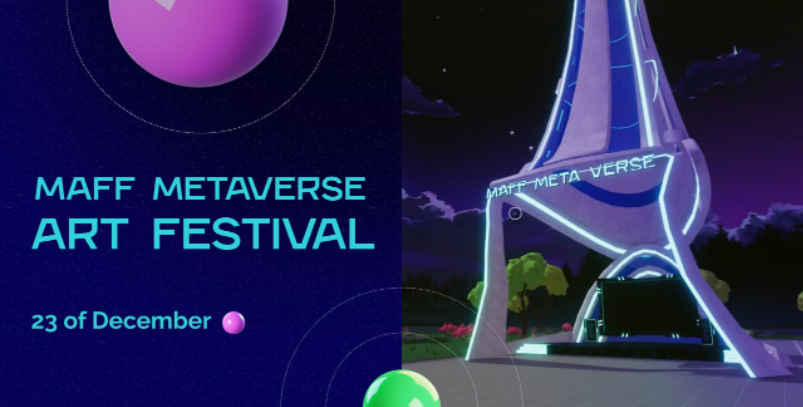

<br />
<p align="center">
  <a >
    
  </a>

<h3 align="center">Decentraland art scene developed for Maff Metaverse HACKATHON<br /><br />[ by Inception Team ]</h3>

  <p align="center">
     
  </p>

## 🌟 About Hackathon

Maff Art Fest - the first festival organized in metaverse by a Russian company!

In November 2021 Maff Metaverse organized an online hackathon to allow designers and programmers all over Russia to create their art objects in Decentraland.

All players will have an opportunity to visit the park and see unique and creative objects that teams have been working hard on.

Each area is different, starting with a digital temple and ending with an escape room.

## ✨ Scene description
This scene is an allusion to the Matrix series of films, symbolizing the duality of the real and digital world.

In the center of the installation is a unique platform in the form of a giant squid machine, which is self-sufficient in itself as an art object and serves as a cyber altar.

So you won't get bored with the cyber prayer, we prepared for you a small interactive quest.

You will need to carefully examine all the space, find all the secrets by following the clues, activate the machine in the form of a squid, and make your choice.

## 📸 Showcase
<p align="center">
<br>
<strong>Scene overview</strong>
</p>

## 🚀 Requirements & Installation

Install the Decentraland CLI (project required decentraland cli version 3.8.3)

```bash
npm install -g decentraland@3.8.3
```

Then install dependencies
```bash
npm install
```

Run scene locally
```bash
npm start
```

## 📄 Links

- Scene playground: https://maff-hackathon-dcl.vercel.app/?position=2,-1
- Art Park: https://play.decentraland.org/?position=63,-146
- About event: https://events.decentraland.org/event/?id=88072901-0a1e-47f2-ba7a-eb7570aef120
- About hackathon: https://metaverse.maff.io/ru/artfest


## 📑 License

This project is open source and available under the [MIT License](LICENSE).
